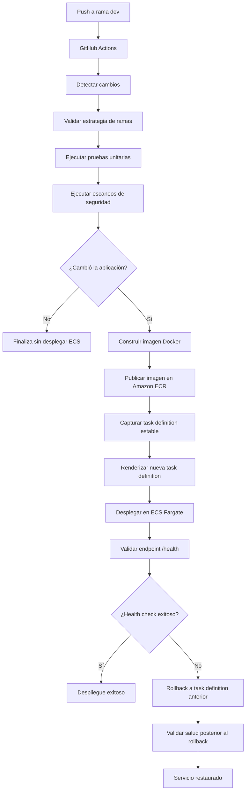

# Prueba Técnica DevSecOps

## Descripción general

El proyecto implementa una solución DevSecOps para desplegar de forma automatizada, segura y resiliente una aplicación contenerizada desarrollada con FastAPI sobre infraestructura aprovisionada mediante Terraform en AWS.

En la solución que se entrega cubrimos el alcance solicitado para la prueba:

- Código fuente de una aplicación simple
- Construcción de imagen Docker
- Aprovisionamiento de infraestructura con Terraform
- Publicación de imagen en Amazon ECR
- Despliegue en Amazon ECS Fargate
- Exposición mediante Application Load Balancer
- Validaciones de seguridad en el pipeline
- Monitoreo y observabilidad
- Validación post despliegue
- Rollback automático ante fallos

---

## Arquitectura implementada

La solución se compone de los siguientes elementos:

- **Aplicación:** API desarrollada con FastAPI
- **Contenerización:** Docker
- **Registro de imágenes:** Amazon ECR
- **Ejecución:** Amazon ECS Fargate
- **Balanceo de carga:** Application Load Balancer
- **Infraestructura como código:** Terraform
- **Pipeline CI/CD:** GitHub Actions
- **Monitoreo:** CloudWatch Logs, Container Insights y ALB Access Logs
- **Seguridad:** Checkov, Trivy, GitHub Secrets y validación de ramas
- **Rollback:** reversión automática hacia la última task definition estable

Recursos principales creados:

- `devsecops-demo-dev-cluster`
- `devsecops-demo-dev-service`
- `devsecops-demo-dev`
- `devsecops-demo-dev-alb`
- `/ecs/devsecops-demo-dev`
- `/aws/ecs/containerinsights/devsecops-demo-dev-cluster/performance`

---

## Stack tecnológico

| Componente | Tecnología |
|---|---|
| Aplicación | FastAPI |
| Lenguaje | Python 3.11 |
| Contenerización | Docker |
| Infraestructura | Terraform |
| Cloud Provider | AWS |
| Compute | ECS Fargate |
| Registry | Amazon ECR |
| Load Balancer | Application Load Balancer |
| CI/CD | GitHub Actions |
| Seguridad IaC | Checkov |
| Escaneo de vulnerabilidades | Trivy |
| Observabilidad | CloudWatch, Container Insights, S3 ALB Logs |

---

## Estructura del repositorio

```text
.
├── app/
│   ├── main.py
│   ├── requirements.txt
│   ├── Dockerfile
│   └── tests/
│       ├── test_app.py
├── infra/
│   ├── backend-bootstrap/
│   ├── environments/
│   └── modules/
│       ├── cloudwatch/
│       ├── ecr/
│       ├── ecs/
│       ├── iam/
│       └── networking/
├── .github/
│   └── workflows/
│       ├── branch-promotion-validation.yml
│       ├── devsecops-pipeline.yml
├── evidence/
└── README.md
```

---

## Aplicación

La aplicación expone endpoints básicos para validar disponibilidad y funcionamiento general de la solución.

Endpoints principales:

| Endpoint | Propósito |
|---|---|
| `/` | Pantalla / respuesta principal de la aplicación |
| `/health` | Validación de salud para ALB y pipeline |

---

## Infraestructura con Terraform

Toda la infraestructura fue aprovisionada mediante Terraform, usando módulos para separar los recursos por dominio funcional.

### Backend remoto

Se implementó un backend remoto para el estado de Terraform:

- S3 para almacenamiento del `terraform.tfstate`
- DynamoDB para bloqueo de concurrencia

Esto permite evitar corrupción del state y controlar ejecuciones simultáneas.

### Modularización

La infraestructura se separó en módulos:

- `ecr`: repositorio de imágenes
- `cloudwatch`: logs de aplicación
- `iam`: roles para ECS
- `ecs`: cluster, task definition y service
- `networking`: ALB, Target Group, Security Groups y logs del ALB

### Variables por ambiente

La configuración por ambiente se maneja mediante archivos `.tfvars`:

```text
infra/environments/tfvars/dev.tfvars
infra/environments/tfvars/qa.tfvars
infra/environments/tfvars/prd.tfvars
```

Ejemplo de ejecución:

```bash
cd infra/environments
terraform init -backend-config="key=dev/terraform.tfstate"
terraform plan -var-file="tfvars/dev.tfvars"
terraform apply -var-file="tfvars/dev.tfvars"
```

---

## Pipeline CI/CD

El pipeline fue implementado con GitHub Actions y se dividió en etapas independientes para mejorar trazabilidad y facilitar diagnóstico en caso de presentarse un error.

### Etapas principales

1. **Detect changed paths**
   - Detecta si hubo cambios en la aplicación.
   - Evita despliegues innecesarios cuando solo cambia documentación u otros archivos que no afectan la aplicación.

2. **Validate branch strategy**
   - Valida la estrategia de ramas definida.

3. **Run unit tests**
   - Ejecuta pruebas unitarias de la aplicación.

4. **Run security scans**
   - Ejecuta Checkov para infraestructura como código.
   - Ejecuta Trivy para análisis de vulnerabilidades.

5. **Build and push Docker image**
   - Construye la imagen Docker.
   - Etiqueta la imagen con el SHA del commit.
   - Publica la imagen en Amazon ECR.

6. **Deploy to ECS**
   - Captura la task definition estable actual.
   - Genera una nueva task definition con la imagen recién publicada.
   - Despliega en ECS Fargate.
   - Espera estabilización del servicio.

7. **Health validation**
   - Valida el endpoint `/health`.
   - Espera respuesta HTTP 200.

8. **Rollback automático**
   - Si el despliegue falla, revierte a la task definition anterior.
   - Valida nuevamente el endpoint de salud.

---

## Diagrama del flujo CI/CD



---

## Estrategia de ramas

Se definió una estrategia de promoción controlada:

```text
dev → lab → main
```

| Rama | Propósito |
|---|---|
| `dev` | Desarrollo e integración inicial |
| `lab` | Validación / homologación |
| `main` | Versión estable |

Las ramas `lab` y `main` cuentan con protección mediante Pull Request.

Adicionalmente, se implementó un workflow de validación para controlar el flujo de promoción:

- `lab` solo debe recibir cambios desde `dev`
- `main` solo debe recibir cambios desde `lab`

---

## Estrategia de despliegue continuo controlado

Para un escenario productivo, el despliegue continuo debería estar controlado por permisos y aprobaciones. La estrategia recomendada sería:

- Mantener el flujo de ramas `dev → lab → main`.
- Permitir despliegues automáticos desde `dev` hacia ambientes de desarrollo.
- Exigir Pull Request para promover cambios hacia `lab` y `main`.
- Configurar protección de ramas para evitar pushes directos a ramas críticas.
- Usar GitHub Environments para definir aprobadores autorizados antes de desplegar a ambientes sensibles.
- Asociar los despliegues a usuarios o equipos autorizados mediante permisos del repositorio y reglas de aprobación.
- Usar GitHub Secrets o, preferiblemente en producción, OpenID Connect (OIDC) con AWS IAM para evitar almacenar credenciales estáticas.
- Registrar trazabilidad completa entre commit, usuario aprobador, pipeline, imagen publicada y task definition desplegada.

Con esta estrategia, el pipeline mantiene automatización, pero los despliegues hacia ambientes controlados requieren aprobación explícita de usuarios autorizados.

---

## Controles de seguridad DevSecOps

La solución incorpora controles de seguridad automatizados dentro del pipeline.

### Checkov

Se ejecuta análisis de seguridad sobre el código Terraform para identificar configuraciones inseguras o mejoras de hardening.

### Trivy

Se ejecuta análisis de vulnerabilidades sobre el filesystem y dependencias del proyecto.

### GitHub Secrets

Las credenciales y valores sensibles se administran mediante GitHub Secrets:

- `AWS_ACCESS_KEY_ID`
- `AWS_SECRET_ACCESS_KEY`
- `AWS_REGION`
- `AWS_ACCOUNT_ID`
- `ECR_REPOSITORY`
- `ECS_CLUSTER`
- `ECS_SERVICE`
- `CONTAINER_NAME`
- `APP_HEALTH_URL`

### Buenas prácticas aplicadas

- No se almacenan credenciales en el repositorio.
- El pipeline usa secrets para autenticación.
- La imagen se publica en ECR usando tags basados en commit SHA.
- Se ejecutan pruebas antes del despliegue.
- Se ejecutan controles de seguridad antes del despliegue.
- Se implementa rollback automático.

---

## Monitoreo y observabilidad

La solución implementa observabilidad básica pero funcional sobre la aplicación y la infraestructura.

### CloudWatch Logs

Logs de aplicación:

```text
/ecs/devsecops-demo-dev
```

Logs de Container Insights:

```text
/aws/ecs/containerinsights/devsecops-demo-dev-cluster/performance
```

### ECS Container Insights

Permite consultar métricas operativas del cluster, servicio y tareas:

- CPU
- memoria
- comportamiento de tareas
- telemetría del servicio

### ALB Health Checks

El Target Group valida el endpoint:

```text
/health
```

### ALB Access Logs

Los logs de acceso del ALB se almacenan en Amazon S3 para trazabilidad, auditoría y análisis posterior.

---

## Estrategia de rollback

El rollback automático fue implementado dentro del pipeline de despliegue.

### Flujo de rollback

1. El pipeline captura la task definition estable actual.
2. Se publica una nueva imagen en ECR.
3. Se genera una nueva task definition.
4. ECS intenta desplegar la nueva versión.
5. El pipeline valida `/health`.
6. Si el despliegue falla:
   - se actualiza el servicio con la task definition anterior
   - se espera estabilización
   - se valida nuevamente `/health`

### Evidencia real de validación

Durante las pruebas se generó un fallo real de despliegue al modificar la configuración de red de ECS, impidiendo que la tarea descargara la imagen desde ECR.

El pipeline detectó que el servicio no alcanzó estado estable, ejecutó rollback hacia la task definition anterior y validó exitosamente la recuperación mediante HTTP 200 en `/health`.

---

## Evidencias

La entrega incluye evidencias de:

- Pipeline CI/CD exitoso
- Despliegue exitoso en ECS
- Endpoint `/health` funcionando
- Target Group saludable
- Logs en CloudWatch
- Métricas en Container Insights
- Logs del ALB almacenados en S3
- Escaneos de seguridad ejecutados
- Rollback automático ejecutado exitosamente

Las evidencias se encuentran en la carpeta:

```text
evidence/
```

Con los siguientes nombres:

```text
01-successful-pipeline.jpg
02-ecs-service-healthy.jpg
03-alb-target-healthy.jpg
04-cloudwatch-app-logs.jpg
05-container-insights.jpg
05-container-insights_2.jpg
06-logs_ecs_devsecops-demo-dev.jpg
07-alb-access-logs-s3.jpg
08-run-unit-tests.jpg
09-run-security-scans.jpg
10-build-and-push-dockerImage.jpg
11-deploy-to-ecs.jpg
12-rollback-Error_ECS_Task.jpg
13-rollback-Error_pipeline-deploy-ecs.jpg
14-rollback-Error_pipeline-deploy-ecs_2.jpg
15-Validate-rollback-health.jpg
16-validate-promotion-flow.jpg
```

---

## Riesgos aceptados y mejoras futuras

En el escaneo de seguridad se evidencian hallazgos que fueron analizados y documentados como mejoras futuras por alcance y tiempo del ejercicio.

| Hallazgo | Decisión |
|---|---|
| ALB con HTTP | Para fines del demo se expone HTTP. En casos de la vida real se debe exponer HTTPS con ACM. |
| ECS con IP pública | La arquitectura demo está basada en subnets públicas. En un escenario productivo se recomienda el uso de subnets privadas con NAT Gateway o VPC Endpoints según requerimientos de seguridad. |
| Security Groups con egress amplio | Para simplificar la conectividad del demo se mantiene habilitado. En casos de la vida real se debe limitar tráfico saliente. |
| KMS administrado por cliente | Se priorizó el uso de cifrado administrado por AWS para acelerar la implementación funcional del ejercicio. La adopción de claves KMS administradas por cliente se documenta como mejora futura. |
| Hardening adicional de S3/DynamoDB | Se priorizó el foco del ejercicio sobre la cadena DevSecOps de despliegue de aplicación. Endurecimientos adicionales sobre componentes de soporte como S3 y DynamoDB se documentan como mejoras futuras. |

---

## Ejecución local

Desde la carpeta de la aplicación:

```bash
cd app
pip install -r requirements.txt
python -m pytest
uvicorn main:app --host 0.0.0.0 --port 8000
```

Validar endpoint:

```bash
http://localhost:8000/health
```

Construcción local de imagen:

```bash
docker build -t devsecops-demo:1.0.0 .
docker run -p 8000:8000 devsecops-demo:1.0.0
```

---

## Conclusión

La solución implementada evidencia una aplicación práctica de principios DevSecOps, integrando infraestructura como código, automatización CI/CD, validaciones de seguridad, monitoreo operativo, despliegue contenerizado y rollback automático.

La solución permite evidenciar un flujo completo desde el cambio de código hasta el despliegue en AWS, manteniendo trazabilidad, control de ramas, validaciones automatizadas y capacidad de recuperación ante fallos.

---

## Autor

María Camila Millán Villalba
