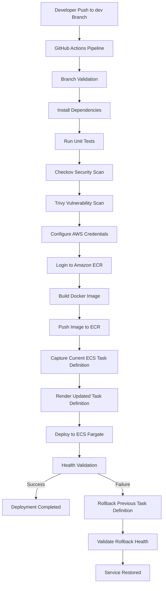

# devsecops-demo

## Overview
This project demonstrates the implementation of a secure DevSecOps CI/CD pipeline for deploying a containerized application on AWS using Infrastructure as Code.

The solution includes:

- FastAPI application containerized with Docker
- Infrastructure provisioning with Terraform
- CI/CD pipeline with GitHub Actions
- Security validation with Checkov and Trivy
- Deployment to Amazon ECS Fargate
- Application Load Balancer integration
- Centralized monitoring with Amazon CloudWatch
- ALB access logging to Amazon S3
- Automated rollback strategy

---

## Architecture

Main AWS services used:

- Amazon ECS Fargate
- Amazon ECR
- Application Load Balancer (ALB)
- Amazon CloudWatch Logs
- Amazon CloudWatch Container Insights
- Amazon S3
- IAM
- Security Groups
- Terraform Remote Backend

---

## Application

Technology stack:

- Python
- FastAPI
- Uvicorn
- Docker

Available endpoints:

### Root endpoint
```http
GET /
```

Response:
```json
{
  "message": "DevSecOps Demo Application"
}
```

### Health endpoint
```http
GET /health
```

Response:
```json
{
  "status": "healthy"
}
```

---

## Infrastructure as Code

Terraform provisions:

- ECS Cluster
- ECS Service
- ECS Task Definition
- ECR Repository
- Application Load Balancer
- Target Group
- Listener
- Security Groups
- CloudWatch Log Group
- S3 Bucket for ALB logs
- S3 bucket encryption
- Public access blocking

Terraform backend:

- S3 remote state
- DynamoDB locking

---

## CI/CD Pipeline

Pipeline stages:

1. Validate branch
2. Install dependencies
3. Run unit tests
4. Run infrastructure security scan (Checkov)
5. Run filesystem vulnerability scan (Trivy)
6. Configure AWS credentials
7. Login to Amazon ECR
8. Build Docker image
9. Push Docker image to ECR
10. Capture current ECS task definition
11. Render updated task definition
12. Deploy new ECS task definition
13. Validate deployment health
14. Automatic rollback if deployment fails
15. Validate rollback health

---

## Security Controls Implemented

### Infrastructure Security
- Terraform static analysis with Checkov
- Security group descriptions
- ALB deletion protection
- Invalid HTTP header dropping
- S3 public access block
- S3 server-side encryption

### Container Security
- Trivy vulnerability scan
- Image registry through Amazon ECR

### Deployment Security
- GitHub Secrets for AWS credentials
- Branch validation protection

---

## Monitoring

Monitoring includes:

### CloudWatch Logs
Application logs:
- `/ecs/devsecops-demo-dev`

Container performance logs:
- `/aws/ecs/containerinsights/devsecops-demo-dev-cluster/performance`

### ECS Monitoring
- Task health
- Deployment status
- Running task metrics

### ALB Monitoring
- Target health checks
- Resource map validation

### Access Logs
- ALB access logs stored in Amazon S3

---

## Rollback Strategy

Rollback is automatically triggered when deployment validation fails.

Workflow:

1. Deploy new task definition
2. Validate application health endpoint
3. If validation fails:
   - Recover previous ECS task definition
   - Redeploy stable version
   - Validate rollback health

Validated failure scenario:
- ECS deployment failed due to Amazon ECR connectivity issue
- Automated rollback restored previous stable task definition successfully

---

## Known Security Findings / Accepted Risks

Some security findings were intentionally documented due to demo scope:

| Finding | Justification |
|--------|---------------|
| ALB HTTP instead of HTTPS | Demo environment only |
| ECS public IP assignment | Required for outbound ECR access in current architecture |
| ECR KMS customer-managed encryption | Default encryption accepted for demo |
| CloudWatch KMS CMK encryption | Enhancement opportunity |
| DynamoDB PITR/KMS findings | Related to Terraform backend bootstrap, not application runtime |

---

## Deployment Evidence

Deployment evidence includes:

- Successful CI/CD execution
- ECS deployment success
- Application healthy target
- CloudWatch logs
- Container Insights metrics
- ALB access logs
- Rollback execution evidence

---

## Repository Structure

```bash
app/
infra/
.github/workflows/
evidence/
README.md
```

---

## Future Improvements

- HTTPS with ACM certificate
- Private ECS networking with NAT Gateway or VPC endpoints
- ECR KMS customer-managed encryption
- CloudWatch KMS encryption
- SNS alerting
- Auto scaling policies
- WAF integration

